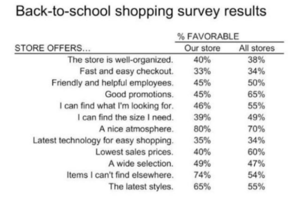

# Atividade 1 de UX com Pontuação

Este repositório é dedicado à atividade ponderada "Atividade 1 de UX com pontuação desenvolvida em sala", correspondente à sexta semana do módulo 3 do Inteli - Instituto de Tecnologia e Liderança. O foco desta atividade é a Experiência do Usuário (UX), mais especificamente acessibilidade, gráficos e técnicas de visualização da informação. Neste contexto, criamos um gráfico **de Barras Divergentes (*Diverging Bar Chart*)** para destacar os principais pontos de atenção dos dados fornecidos que estão disponíveis na imagem abaixo:

Figura 01 - Imagem dos dados
 

 
Fonte: Tabela 3 fornecida pelo professor

E aqui está o gráfico representando esses dados:

Figura 03 - Imagem do gráfico
   

 
Fonte: Material produzido pelos autores

  
## Escolha do gráfico e das cores 

Optamos pelo gráfico de barras divergentes por ser uma das melhores opções para comparar visualmente os pontos em que "Nossa Loja" está à frente ou atrás de "Outras Lojas". Este tipo de gráfico destaca claramente as diferenças positivas (em verde) e negativas (em vermelho), permitindo uma visualização intuitiva dos dados.

Outras opções de gráficos que consideramos incluíam:

- **Gráfico de Barras Empilhadas**: embora útil para mostrar proporções, descartamos porque não realçava tanto as discrepâncias entre as lojas.
- **Gráfico de Pontos**: considerado pela simplicidade, mas optamos por uma abordagem mais visualmente impactante.
- **Radar Chart**: descartado por ser menos claro em relação à magnitude das diferenças e a comparação direta.

Optamos por utilizar a cor verde para representar os momentos em que "Nossa Loja" está à frente, e vermelho para os momentos em que está atrás, pois essas cores são amplamente reconhecidas como indicadores universais de "bom" e "ruim", respectivamente. O verde, em muitas culturas, está associado ao sucesso, crescimento ou desempenho positivo, enquanto o vermelho é frequentemente associado a alertas, falhas ou desempenho negativo. Essa escolha facilita a interpretação do gráfico, seguindo padrões visuais que já são familiares para os usuários.

## Insights retirados do gráfico

Através do gráfico de barras divergentes, é possível observar que "Nossa Loja" está significativamente à frente em categorias como "Itens que não encontro em outro lugar" e "Ambiente agradável", o que pode indicar um diferencial competitivo. Por outro lado, estamos atrás em aspectos críticos como "Preços baixos" e "Boas promoções", o que sugere áreas de melhoria importantes para aumentar a competitividade. Esses insights são cruciais para direcionar as estratégias da loja, seja fortalecendo os pontos fortes ou corrigindo os fracos.

## Método de Criação

O gráfico foi feito manualmente utilizando o Canva, com o auxílio de uma caneta digital, conforme orientações da tarefa e acordado com o professor responsável. O processo manual pode causar alguns pontos de atenção, como:

- **Falta de preenchimento perfeito**: Algumas áreas podem não estar completamente preenchidas.
- **Simetria imperfeita**: As barras podem não estar perfeitamente simétricas.

Optamos por manter essas características, pois são inerentes a um gráfico feito à mão, conforme a proposta da atividade. Acreditamos que esses detalhes não afetam significativamente a compreensão e interpretação do gráfico, por isso decidimos manter essa abordagem.

Em conclusão, durante o processo de decisão, escolhemos o gráfico de barras divergentes pela clareza e impacto visual que ele proporciona na comparação direta entre "Nossa Loja" e "Outras Lojas". Decidimos manter as imperfeições que surgiram do processo manual de criação do gráfico, pois elas reforçam a proposta original da atividade. Os insights gerados oferecem um caminho claro para melhorar o desempenho da loja nas áreas que estão atrás e reforçar os pontos onde já temos uma vantagem competitiva.
